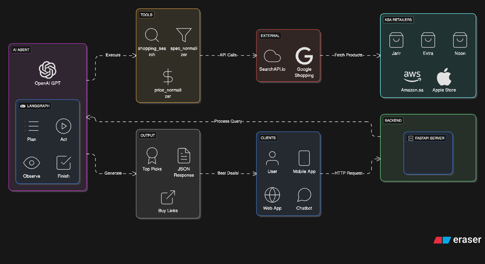

# 🛒 SallaAI Agent – AI Shopping Assistant for Saudi Market

> Ever spent hours comparing prices across Jarir, Noon, Extra, and Amazon just to find the best deal? Yeah, me too. So I built something to do it for me.

An AI-powered shopping agent that searches, compares, and recommends the best deals from trusted Saudi retailers — all in one API call.



---

## 🎯 What It Does

Give it a query like `"iPhone 15 Pro 256GB"` or `"27 inch 2K monitor"` and it will:

1. **Search** Google Shopping via SearchAPI.io
2. **Normalize** retailer names (e.g. `"جرير"` → `"Jarir"`)
3. **Extract** specs (model, storage, condition)
4. **Convert** prices to SAR
5. **Rank** by trusted retailers + condition + price
6. **Return** clean JSON with top picks

No more 47 browser tabs. Just the best deals.

---

## 🧠 How It Thinks

The agent uses a **LangGraph** workflow:
```
Plan → Act → Observe → Finish
```

- **Plan**: Understands what you're looking for
- **Act**: Executes search and normalization tools
- **Observe**: Analyzes results from retailers
- **Finish**: Returns ranked recommendations

Powered by **OpenAI GPT** for reasoning.

---

## 🏪 Trusted Saudi Retailers

The agent prioritizes these KSA retailers:

| Retailer | Why Trusted |
|----------|-------------|
| 🏬 Jarir | Largest electronics retailer in KSA |
| 📺 Extra | Wide selection, competitive prices |
| ☀️ Noon | Fast delivery, good deals |
| 📦 Amazon.sa | Reliable, easy returns |
| 🍎 Apple Store | Official products, warranty |

---

## ⚙️ Selection Policy

The agent ranks products by:

1. **Retailer Trust** → Prefers known Saudi retailers
2. **Condition** → New > Refurbished > Used > Unknown
3. **Price** → Lowest in SAR wins

---

## 🛠️ Tech Stack

| Tech | Purpose |
|------|---------|
| Python 3.12+ | Core language |
| FastAPI | REST API framework |
| LangGraph | Agent orchestration |
| OpenAI API | LLM reasoning |
| SearchAPI.io | Google Shopping data |

---

## 🚀 API Endpoints

### `POST /rank`
Main endpoint — send a product query, get ranked recommendations.

**Request:**
```json
{
  "query": "iPhone 15 Pro 256GB"
}
```

**Response:**
```json
{
  "recommendations": [
    {
      "product": "iPhone 15 Pro 256GB",
      "retailer": "Jarir",
      "price": 4199,
      "currency": "SAR",
      "condition": "New",
      "link": "https://jarir.com/..."
    }
  ]
}
```

---

## 🔧 Agent Tools

| Tool | Function |
|------|----------|
| `shopping_search` | Searches Google Shopping via SearchAPI.io |
| `spec_normalizer_batch` | Extracts and standardizes product specs |
| `price_normalizer_batch` | Converts all prices to SAR |

---

## 📦 Installation
```bash
# Clone the repo
git clone https://github.com/KhalidD0nc/SallaAI_Agent.git
cd SallaAI_Agent

# Install dependencies
pip install -r requirements.txt

# Set up environment variables
cp .env.example .env
# Add your OPENAI_API_KEY and SEARCHAPI_KEY

# Run the server
uvicorn main:app --reload
```

---

## 🔮 What's Next

- [ ] Add `/chat` endpoint for conversational interface
- [ ] Support more retailers
- [ ] Add price history tracking
- [ ] Build frontend UI

---

## 📄 License

MIT License — use it, improve it, share it.

---

**Built with ☕ and frustration from too many browser tabs**
